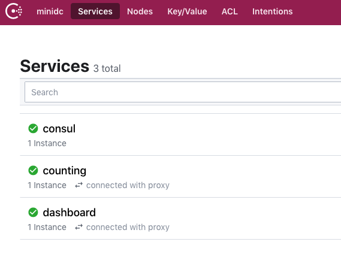
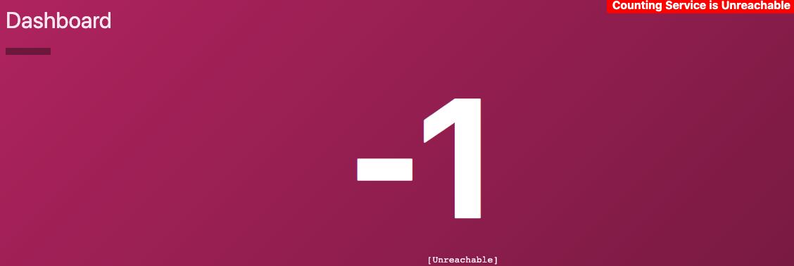
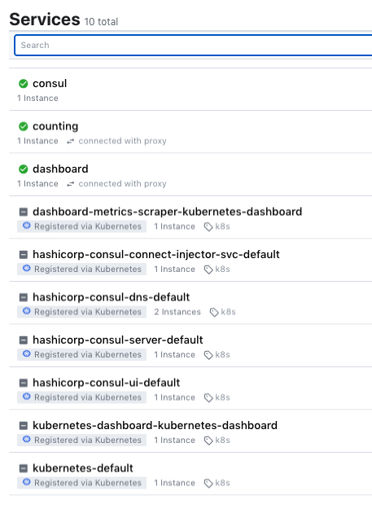

# consul-demo
Creating a consul cluster locally to play with the service-mesh concepts

Consul is a service mesh solution providing a full featured control plane with service discovery, configuration, and segmentation functionality.

## Key-Features
The key features of Consul are:

- Service Discovery: Clients of Consul can register a service, such as api or mysql, and other clients can use Consul to discover providers of a given service. Using either DNS or HTTP, applications can easily find the services they depend upon.

- Health Checking: Consul clients can provide any number of health checks, either associated with a given service ("is the webserver returning 200 OK"), or with the local node ("is memory utilization below 90%"). This information can be used by an operator to monitor cluster health, and it is used by the service discovery components to route traffic away from unhealthy hosts.

- KV Store: Applications can make use of Consul's hierarchical key/value store for any number of purposes, including dynamic configuration, feature flagging, coordination, leader election, and more. The simple HTTP API makes it easy to use.

- Secure Service Communication: Consul can generate and distribute TLS certificates for services to establish mutual TLS connections. Intentions can be used to define which services are allowed to communicate. Service segmentation can be easily managed with intentions that can be changed in real time instead of using complex network topologies and static firewall rules.

- Multi Datacenter: Consul supports multiple datacenters out of the box. This means users of Consul do not have to worry about building additional layers of abstraction to grow to multiple regions.


## Steps

### Minikube Init
```
minkube start --memory 4096
minikube dashboard
minkube addons enable helm-tiller

```

### Helm install
Check your minikube dashboard to make sure tiller is installed. If not, then you can do the following...

`helm init`
> If Tiller gives you issues

```
helm init --service-account tiller --override spec.selector.matchLabels.'name'='tiller',spec.selector.matchLabels.'app'='helm' --output yaml | sed 's@apiVersion: extensions/v1beta1@apiVersion: apps/v1@' | kubectl apply -f -
```

### Install Helm Chart
```
helm install -f helm-consul-values.yaml --name hashicorp hashicorp/consul
```

### Confirm that consul is up
```
minikube service list
minikube service hashicorp-consul-ui
```

## Deploy sample-apps
```
kubectl create -f sample-apps
```



```
kubectl port-forward dashboard 9002:9002
```
Visit http://localhost:9002 in your web browser. It will display the dashboard service running in a Kubernetes pod, with a number retrieved from the counting service using Consul service discovery, and transmitted securely over the network with mutual TLS via an Envoy proxy.


## Access Control

> Deny

Create an intention to prevent the dashboard service from reaching its upstream counting service using the -deny flag.

```
kubectl exec hashicorp-consul-server-0 -- consul intention create -deny dashboard counting
```


> Allow
```
kubectl exec hashicorp-consul-server-0 -- consul intention create dashboard counting
```

## Rolling Updates
Modify your `helm-consul-values` file and then `helm upgrade`

```
syncCatalog:
  enabled: true
```

```
helm upgrade hashicorp -f helm-consul-values.yaml hashicorp/consul
```



