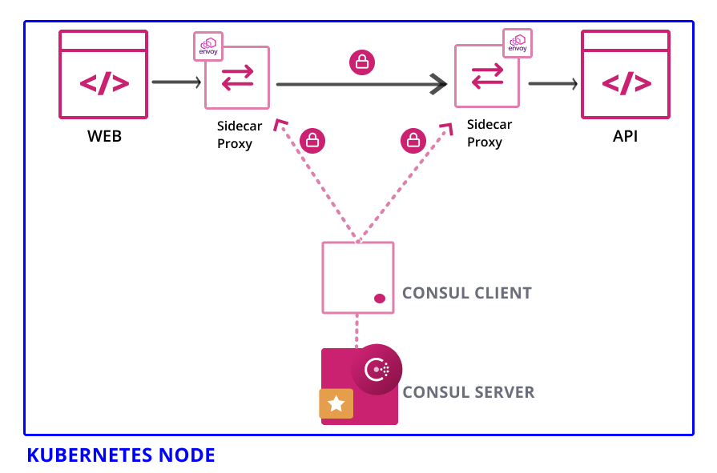
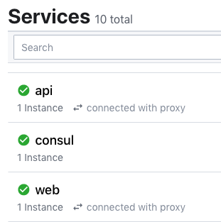
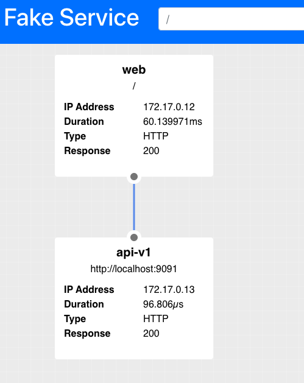
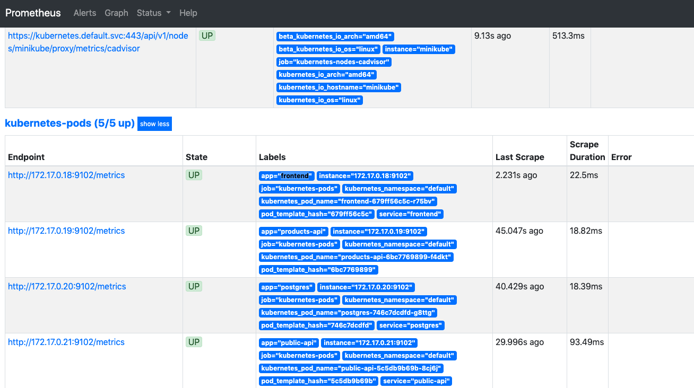
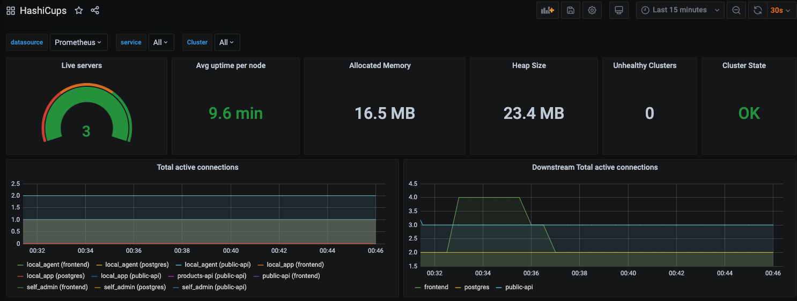

# Consul Service-Mesh Demo

## Install Consul
```
helm install --name hashicorp hashicorp/consul -f consul-values.yaml

kubectl get services

```

## Access UI
```
kubectl port-forward service/hashicorp-consul-ui 18500:80 --address 0.0.0.0
```

## See the members
```
kubectl exec -it hashicorp-consul-server-0 -- consul members  

Node                       Address           Status  Type    Build  Protocol  DC   Segment
hashicorp-consul-server-0  172.17.0.10:8301  alive   server  1.8.2  2         dc1  <all>
minikube                   172.17.0.11:8301  alive   client  1.8.2  2         dc1  <default>
```

## Securing the applications (w/ Sidecar)

We will deploy two services, web and api, into Consul's service mesh running on a Kubernetes cluster. The two services will use Consul to discover each other and communicate over mTLS with sidecar proxies.

Add the following to your k8 manifests
```
"consul.hashicorp.com/connect-inject": "true"
```

Look at `k8s_config/api.yaml` and `k8s_config/web.yaml` :

- The web frontend service is downstream from the api service.
- The api service is upstream from the web service.
- By using the `consul.hashicorp.com/connect-service-upstreams` annotation, you are explicitly declaring the upstream for the web service.
- Using the format name:addr, such as `api:9091` will make the api service available on `localhost:9091` in the web service pod. When the web service makes a request to `localhost:9091`, the sidecar proxy will establish a secure mTLS connection with the api service and forward the request.

### Deploy the apps
```
kubectl apply -f k8s_config
```


- Access app UI
```
kubectl port-forward service/web 9090:9090 --address 0.0.0.0
```


### Access Control
- Deny Intention
```
kubectl exec -it hashicorp-consul-server-0 -- consul intention create -deny "*" "*"

Created: * => * (deny)
```
- Allow Intention
```
kubectl exec -it hashicorp-consul-server-0 -- consul intention create -allow web api

Created: web => api (allow)
```

- Intentions control which services can communicate with each another and are enforced by the sidecar proxy on inbound connections. 
- The identity of the inbound service is verified by its TLS client certificate. 
- The sidecar proxy then checks if an intention exists that authorizes the inbound service to communicate with the destination service. 
- If the inbound service is not authorized, the connection will be terminated.


## L7 Traffic Monitoring
The sidecar proxies are capable of collecting Layer 7 (L7) metrics, like HTTP status codes or request latency from your services. This data can be exported to monitoring tools like Prometheus.

### Setup
```
helm repo add stable https://kubernetes-charts.storage.googleapis.com && \
helm repo add hashicorp https://helm.releases.hashicorp.com && \
helm repo update

cd monitoring-demo
```

### Deploys
```
helm install -f helm/consul-values.yaml --name consul hashicorp/consul --version "0.23.1" --wait

helm install -f helm/prometheus-values.yaml --name prometheus stable/prometheus --version "11.7.0" --wait

helm install -f helm/grafana-values.yaml --name grafana stable/grafana --version "5.3.6" --wait
```

### Sample App Deployment

- Deploy sample app using : `kubectl apply -f app`
- Port forward to fronted: `kubectl port-forward deploy/frontend 8080:80`
- Test sample app `curl -I localhost:8080` to observe `HTTP/1.1 200 OK`
- Port forward to sidecar-proxy:`kubectl port-forward deploy/frontend 19000:19000`
- Test sidecar-proxy `curl localhost:19000/config_dump | grep envoy_prometheus_metrics_listener` to observe two instances occur

## Visualize Metrics

- Port Forward to Prometheues : `kubectl port-forward deploy/prometheus-server 9090:9090`
- Browse to `http://localhost:9090/graph`
- Enter `sum by(__name__)({app="products-api"})` and click `Execute` perform a PromQL query that will list all available metrics for resources that have the product-api label
- Browse to `http://localhost:9090/targets` where you will find 
  


## Grafana
- Generate some traffic : `kubectl apply -f traffic.yaml`
- Get Access to Grafana
```
export POD_NAME=$(kubectl get pods --namespace default -l "app.kubernetes.io/name=grafana,app.kubernetes.io/instance=grafana" -o jsonpath="{.items[0].metadata.name}") && \
  kubectl --namespace default port-forward $POD_NAME 3000

Forwarding from 127.0.0.1:3000 -> 3000
Forwarding from [::1]:3000 -> 3000
```
> default username: `admin`; default password: `password`

> !! this is just a demo, *never* keep password as `password` !!

- Browse to `http://localhost:3000/dashboards`, import the config for the dashboard from `/grafana/hashicups-dashboard.json`
- Browse to `http://localhost:3000/d/hashicups/hashicups?orgId=1&refresh=30s`


# Cleanup
`minikube delete`
